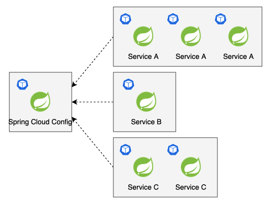
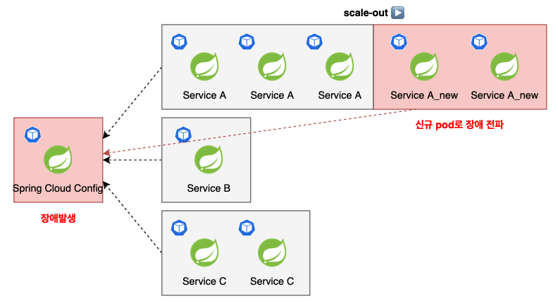
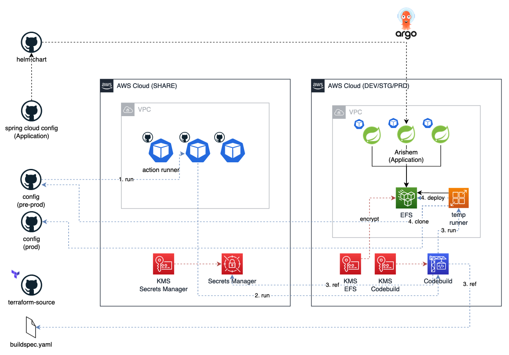
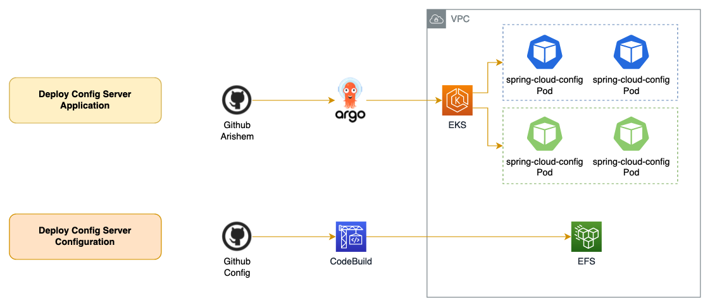

= Config Server - Concept (1)

Service 를 release 하는데에 있어서 *Configuration* 은 서로 다른 환경을 구분한 다는 점에서 매우 중요합니다.
개발환경과 운영환경은 일부 설정 값을 제외한 모든 것이 동일해야합니다. 너무나 당연한 말이지만 의외로 많은 enterprise 환경에서 쉽게 지켜지지 못하고 있는 전제이기도 합니다.

link:https://12factor.net/config[12-Factor App] 에서는 Service 를 개발할 때 고려야해야할 12가지 요인들을 제시합니다. 이 중 3번째가 바로 Config 에 대한 내용입니다.
여기서는 3가지를 config 에 저장할 것을 권고하고 있습니다.

* Resource handles to the database, Memcached, and other backing services
* Credentials to external services such as Amazon S3 or Twitter
* Per-deploy values such as the canonical hostname for the deploy

전부 Source 와 직접적인 관계 없는, 오로지 *환경* 에만 관련이 있는 값들을 config 에 저장하여 환경별로 구성할 것을 권고합니다.
그리고 이 내용을 준수했을때, 우리는 개발환경에서 테스트하고 검증한 결과를 토대로 운영환경에 대한 신뢰성을 확보할 수 있게됩니다.

Config 서버는 Service Orchestration 을 구성하는 모든 MSA 서비스들이 참조하는 Single Point of Failure (SPOF) 중 하나입니다.
Config 서버 장애시 Scale-out 된 모든 서비스에 장애가 전파됩니다. 따라서 Config 서버의 가용성 확보는 매우 중요한 과제입니다.

== Spring Cloud Config

우리 서비스는 Spring boot 기반으로 작성되어있으며 Spring Cloud 에서는 Spring Cloud Config 라는 편리한 config server framework 를 제공합니다.
Spring Cloud Config 에서 서비스들의 실제 설정값을 저장하고 있는 위치를 **backend** 라고 부릅니다.
우리는 backend 로써 local file system 을 사용하여 구축했습니다.
git remote repository 에 대한 backend 구성이 가능하고, 가장 recommand 되고 있지만 github 장애시 Config 서버 장애와 동일한 영향범위를 갖고있습니다.
Config 서버는 backend 에 대한 장애 종속성이 높습니다. 따라서 backend 에 대한 가용성 확보가 무엇보다 중요합니다.

저희 팀은 경험을 통해 Github 이 장애가 잦다는 사실을 인지하고 있습니다.
따라서 Github 을 사용하는 대신, Source 를 sync 하여 CodeCommit 을 사용하는 방안, EFS 를 활용하여 local file system 을 활용하는 방안을 두고 아키텍처를 고민했습니다.

결론적으로 현재 EFS 를 사용하여 config 를 공유하는 방식이 채택 되었으며, CodeCommit 을 배제하게 된 이유는 테크니컬 이슈가 있습니다. 이에 대해서는 별도의 페이지에서 공유하겠습니다.

== Architecture

* Spring cloud config 을 구성하는 infra 는 EKS 의 pod 입니다.
* 실제 Service 들의 config 정보를 저장하는 위치는 EFS 입니다.
* Spring cloud config pod 들은 그 efs 를 마운트하여 동일한 내용을 제공합니다.

== Deployment

=== Type

Spring cloud config 의 배포는 2가지가 있습니다. Application 을 새 버전으로 개정하고 그 버전을 배포하는 경우와 (Deploy Config Server Application)
Service 들의 Config 들의 수정이나 신규내용 등 새로운 버전을 배포하는 경우입니다. (Deploy Services Configuration)

* Deploy Config Server Application : +
Spring Cloud Config 의 버전 개정 등 config 서버 자체의 속성이 변하는 경우 발생합니다.
* Deploy Services Configuration : +
Service Orchestration 을 구성하는 모든 서비스들의 속성이 변경할 때 발생합니다. 예를들어 vodlookup 서비스가 접근하는 DB 의 endpoint 또는 접속정보 (id, password) 등이 변경할 때 배포가 발생합니다.

=== Scenario

* Deploy Config Server Application : EKS 의 pod 배포 방식으로 배포됩니다. argoCD 로 배포합니다.
* Deploy Services Configuration : Spring cloud config application 들은 서비스들의 config 를 local file 을 참조하도록 설정되어 있습니다.
여기서 참조하는 config 의 path 는 EFS 에 마운트 되어 있어, 모든 application 들이 동일한 정보를 제공할 수 있도록 구성되어있습니다.
EFS 는 source 에 수정사항이 발생하면 CodeBuild 컨트롤러가 새로운 빌드 인스턴스를 생성하고 그 인스턴스에 EFS 를 마운트하여 변경내용을 EFS 에 write 합니다.
이 write 하는 시점에, 모든 Config 서버들은 새로운 configuration 정보를 제공할 수 있는 상태가 됩니다.

Source 수정 (config 수정) → CodeBuild 실행 → CodeBuild build instance 에 EFS 마운트 → git 변경사항을 EFS 경로에 pull (배포 적용 시점)

=== Frequency

Spring Cloud Config 는 config 서버이기 때문에 2 가지 경우 모두 일반 서비스에 비해서 자주 발생하는 배포 아닙니다.
그러나 두 경우 중에서 Deploy Services Configuration 은 배포가 일어날 가능성이 비교적 있는 편이며, Deploy Config Server Application 의 경우 일어날 일이 거의 없습니다.